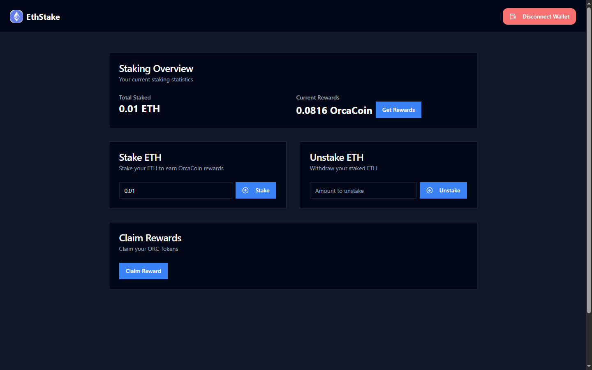

# 🐳 EthStake - Stake ETH & Earn Orca Tokens

> EthStake is a decentralized staking platform that allows users to stake native ETH and earn **Orca Tokens** as rewards. It provides a seamless and secure way for Ethereum holders to earn yield by participating in staking.

---

## 🎮 Live Demo

🎲 [Try EthStake Live](https://eth-stake-gilt.vercel.app)  

---

## ✨ Features

- 🔐 Stake native ETH directly from your wallet
- 🎁 Earn Orca Tokens as staking rewards
- 🧠 Smart contracts written in Solidity
- ⚡️ Fast and modern frontend using Next.js + TailwindCSS
- 🔗 Web3 integration using Wagmi for a smooth user experience

---

## 🛠 Tech Stack

- **Smart Contracts**: Solidity  
- **Frontend Framework**: Next.js  
- **Smart Contract Interaction**: Wagmi + Ethers.js  
- **Styling**: TailwindCSS  

## 🎬 Demo Video

---

## 📸 Screenshots

---
